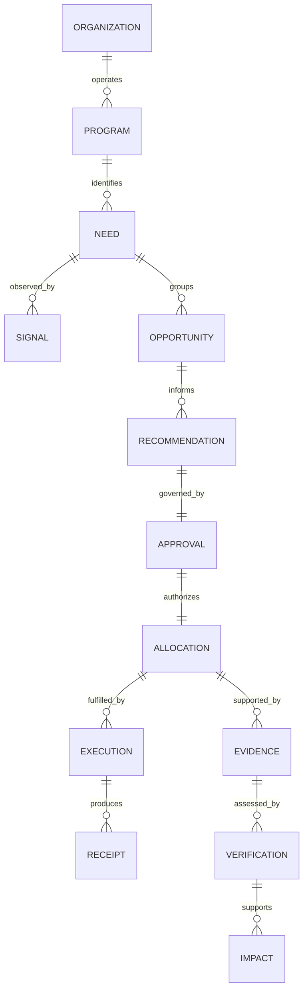

# Domain model diagram

```mermaid
erDiagram
  ORGANIZATION ||--o{ PROGRAM : operates
  PROGRAM ||--o{ NEED : identifies
  NEED ||--o{ SIGNAL : observed_by
  NEED ||--o{ OPPORTUNITY : groups
  OPPORTUNITY ||--o{ RECOMMENDATION : informs
  RECOMMENDATION ||--|| APPROVAL : governed_by
  APPROVAL ||--|| ALLOCATION : authorizes
  ALLOCATION ||--o{ EXECUTION : fulfilled_by
  ALLOCATION ||--o{ EVIDENCE : supported_by
  EXECUTION ||--o{ RECEIPT : produces
  EVIDENCE ||--o{ VERIFICATION : assessed_by
  VERIFICATION ||--o{ IMPACT : supports
```

Terms are defined in the [glossary](../glossary/README.md).
