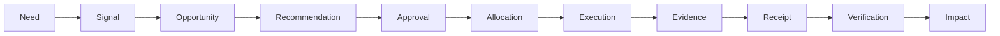

# Lifecycle diagram

```mermaid
flowchart LR
  Need --> Signal --> Opportunity --> Recommendation --> Approval --> Allocation --> Execution --> Evidence --> Receipt --> Verification --> Impact
```

`Approval → Allocation` is a mandatory human gate in the MVP. See [SPEC-004](../specs/SPEC-004-event-lifecycle.md).
